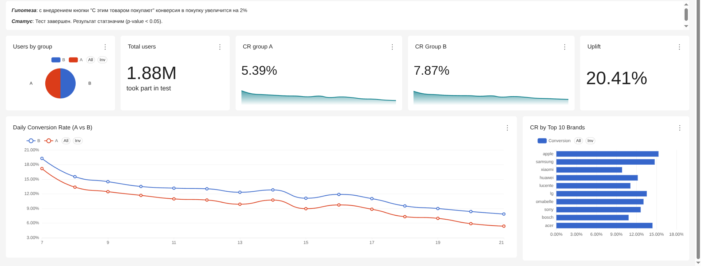
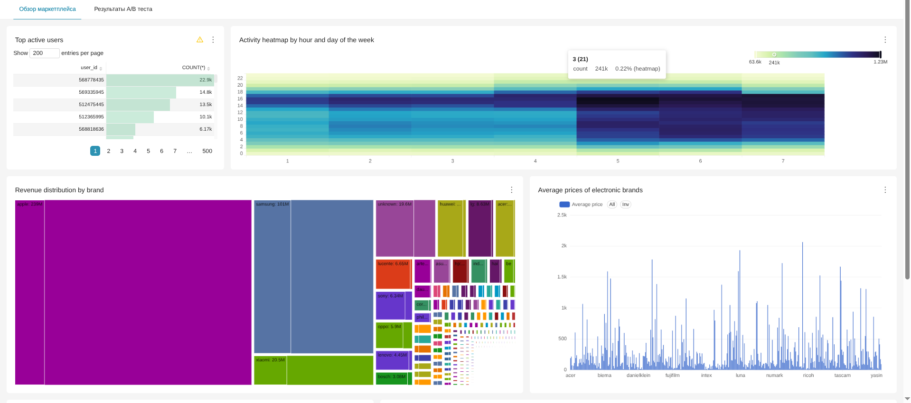
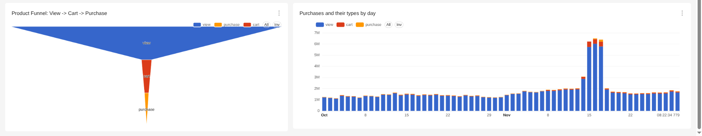

# E-Commerce A/B Test & Analytics
### О проекте:
Комплексный аналитический проект основанный на [eCommerce данных](https://www.kaggle.com/datasets/mkechinov/ecommerce-behavior-data-from-multi-category-store/data) за 2 месяца включающий 285 млн. юзеров.
В рамках проекта была создана локальная аналитическая система DWH + BI и проведен A/B тест для тестирования продуктовой гипотезы.
### Стек:

  
  
  
  
  
  
  
  

---

### Результаты A/B тестирования
В тесте приняло участие 1.88M уникальных пользователей.

| Метрика | Группа A (Control) | Группа B (Test) | Uplift | Стат. значимость (p-value) |
| :--- | :--- | :--- | :--- | :--- |
| Conversion Rate (CR) | 5.39% | 7.87% | +20.41% | < 0.05 (Z-test) |

Продуктовый вывод: Внедрение кнопки статистически значимый прирост конверсии. Анализ в разрезе брендов показал, что эффект стабилен на топ-10 брендов (Apple, Samsung, Xiaomi и т.п). **Рекомендация: раскатить фичу на 100% пользователей.**

---

### Дашборды (Apache Superset)
### 1. Результаты A/B теста

### 2. Аналитический обзор маркетплейса

### Архитектура данных
1. ETL-процесс: Сырые логи обрабатываются чанками с помощью pandas, очищаются от пустых значений и приводятся типы.
2. Сплитование: Пользователи разделены на группы А и B (50/50).
3. Хранилище: Обработанные датафреймы загружаются в колоночную СУБД **ClickHouse**.
4. Визуализация: ClickHouse подключен к **Apache Superset**, где написаны SQL-запросы для создания витрин и дашбордов.
